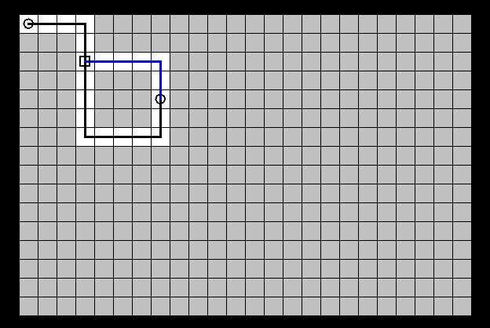

# com.otabi.Grid.Grid
---
This little Java program will allow you to draw maze solutions using a Java Canvas.
* The grid will handle all conversions between grid space and canvas space. 
* The dimensions are currently hardcoded in com.otabi.Grid.Grid.
* The background color of each cell is set automatically based upon the paths.
* The path color can be changed for the optimal path.

Please let me know what changes you need.

## Instructions

The main contains the example grid.

1. Get the ```com.otabi.Grid.Grid``` singleton, getInstance can optionally take a width and height parameter.
1. Add paths, each is an ```ArrayList``` of ```java.awt.Point```. You can also tell the system to mark the optimal path with a different color.
1. Mark the starting and ending points by adding terminators.
1. Mark the junctions by adding intersections.
1. Set it visible

You can use saveImage to write the output to ```/tmp/canvas.png```.
```java
        com.otabi.Grid.Grid grid = com.otabi.Grid.Grid.getInstance();

        ArrayList<Point> path = new ArrayList<>();
        path.add(new Point(0,0));
        path.add(new Point(3,0));
        path.add(new Point(3,4));
        path.add(new Point(3, 6));
        path.add(new Point(7, 6));
        path.add(new Point(7, 4));
        grid.addPath(path);

        path = new ArrayList<>();
        path.add(new Point(3, 2));
        path.add(new Point(7, 2));
        path.add(new Point(7, 4));
        grid.addPath(path, true);

        grid.addTerminator(0, 0);
        grid.addTerminator(4, 7);

        grid.addIntersection(2, 3);

        grid.setVisible(true);

```
